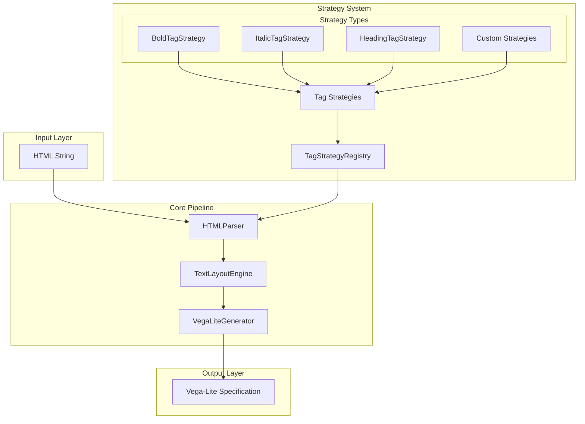
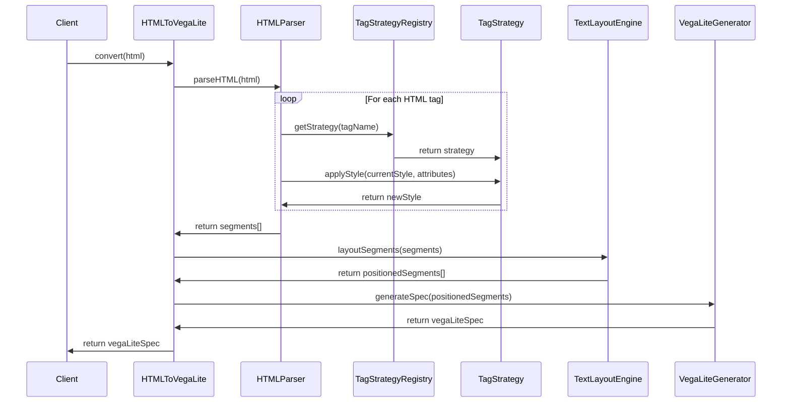

# HTML-to-Vega-Lite Architecture Documentation

## Overview

The HTML-to-Vega-Lite converter is a TypeScript library that transforms HTML content into Vega-Lite visualization specifications. The architecture follows a modular, pipeline-based approach with extensible strategy patterns for handling different HTML tags.

## System Architecture

### High-Level Architecture Diagram



### Component Interaction Sequence



## Core Components

### 1. HTMLToVegaLite (Main Controller)

**Location**: `src/index.ts`

The main entry point that orchestrates the entire conversion pipeline.

**Key Responsibilities**:
- Initialize and configure pipeline components
- Coordinate the parsing → layout → generation flow
- Expose public API for customization
- Manage global options and overrides

**Public API**:
```typescript
class HTMLToVegaLite {
  convert(html: string, overrideOptions?: Partial<HTMLToVegaLiteOptions>): VegaLiteSpec
  registerTagStrategy(strategy: TagStrategy): void
  unregisterTagStrategy(strategyName: string): boolean
  validateHTML(html: string): { isValid: boolean; errors: string[] }
}
```

### 2. HTMLParser (Strategy Orchestrator)

**Location**: `src/parser.ts`

Parses HTML strings into styled text segments using the strategy pattern.

**Key Responsibilities**:
- Tokenize HTML content
- Apply tag strategies to generate styled segments
- Validate HTML structure and attributes
- Manage the strategy registry

**Core Algorithm**:
1. Split HTML into text and tag tokens
2. Maintain a style stack for nested tags
3. For each opening tag, apply corresponding strategy
4. Generate `TextSegment` objects with accumulated styles

### 3. Strategy System

The strategy system provides extensible HTML tag handling through a well-defined interface.

#### TagStrategy Interface

**Location**: `src/strategies/interfaces/tag-strategy.interface.ts`

```typescript
interface TagStrategy {
  applyStyle(currentStyle: TextStyle, attributes: string, tagName?: string): TextStyle;
  getTagNames(): string[];
  validateAttributes?(attributes: string): ValidationResult;
  isLineBreak?(): boolean;
}
```

#### Strategy Registry

**Location**: `src/strategies/registry/tag-strategy-registry.ts`

Manages the collection of available tag strategies.

**Key Features**:
- Dynamic strategy registration/removal
- Tag name to strategy mapping
- Support for multiple tags per strategy
- Factory functions for common configurations

#### Built-in Strategies

**Location**: `src/strategies/implementations/`

| Strategy | Tags | Purpose |
|----------|------|---------|
| `BoldTagStrategy` | `<b>`, `<strong>` | Apply bold font weight |
| `ItalicTagStrategy` | `<i>`, `<em>` | Apply italic font style |
| `HeadingTagStrategy` | `<h1>`-`<h6>` | Set heading font sizes |
| `UnderlineTagStrategy` | `<u>` | Add underline decoration |
| `SpanTagStrategy` | `<span>` | Parse inline CSS styles |
| `HyperlinkTagStrategy` | `<a>` | Handle links with validation |
| `LineBreakTagStrategy` | `<br>` | Insert line breaks |
| `CodeTagStrategy` | `<code>`, `<pre>` | Apply monospace styling |

### 4. TextLayoutEngine (Positioning System)

**Location**: `src/layout.ts`

Converts styled text segments into positioned elements with coordinates and dimensions.

**Key Responsibilities**:
- Calculate text dimensions using Canvas API or fallbacks
- Position text segments in 2D space
- Handle line wrapping and breaks
- Compute overall bounds

**Text Measurement Strategy**:
- **Browser Environment**: Canvas API for accurate measurements
- **Node.js Environment**: Character-based fallback calculations

### 5. VegaLiteGenerator (Output Generator)

**Location**: `src/vega-generator.ts`

Transforms positioned segments into Vega-Lite specification JSON.

**Key Responsibilities**:
- Group segments by visual style
- Create Vega-Lite layers for each style group
- Generate text decoration layers (underlines, strikethrough)
- Apply global formatting options

**Style Grouping Algorithm**:
- Create unique keys based on: `fontWeight-fontStyle-color-textDecoration-fontSize`
- Merge segments with identical styling into single layers
- Optimize for minimal layer count

## Data Flow Pipeline

### 1. Input Processing

```
HTML String → HTML Tokens → Tag + Text Pairs
```

**Example**:
```html
"<b>Bold</b> normal <i>italic</i>"
→ [["<b>", "Bold", "</b>"], [" normal "], ["<i>", "italic", "</i>"]]
```

### 2. Style Application

```
Text + Tags → Style Stack → Styled Segments
```

**Example**:
```typescript
// Input: <b>Bold</b>
// Strategy: BoldTagStrategy
// Output: TextSegment {
//   text: "Bold",
//   fontWeight: "bold",
//   fontStyle: "normal",
//   color: "#000000"
// }
```

### 3. Layout Calculation

```
Styled Segments → Measured Segments → Positioned Segments
```

**Example**:
```typescript
// TextSegment → PositionedTextSegment
{
  text: "Bold",
  fontWeight: "bold",
  x: 10,           // ← Layout engine adds
  y: 30,           // ← positioning data
  width: 45,       // ← and dimensions
  height: 14
}
```

### 4. Vega-Lite Generation

```
Positioned Segments → Style Groups → Vega-Lite Layers → Final Spec
```

**Example**:
```json
{
  "$schema": "https://vega.github.io/schema/vega-lite/v5.json",
  "layer": [
    {
      "data": { "values": [{"text": "Bold", "x": 10, "y": 30}] },
      "mark": { "type": "text", "fontWeight": "bold" },
      "encoding": { ... }
    }
  ]
}
```

## Configuration System

### Options Hierarchy

1. **Constructor Defaults**: Base configuration when creating `HTMLToVegaLite`
2. **Method Overrides**: Per-conversion options in `convert(html, options)`
3. **Strategy-Specific**: Individual strategies can set specific properties (e.g., fontSize for headings)

### Option Precedence Rules

```typescript
// Priority (highest to lowest):
1. Method override options (when explicitly set)
2. Strategy-specific properties (fontSize from HeadingTagStrategy)
3. Constructor defaults (global settings)
```

**Example**:
```typescript
// Global default: fontSize: 14
const converter = new HTMLToVegaLite({ fontSize: 14 });

// H1 strategy sets: fontSize: 32
// Method override: fontSize: 20

// Result: H1 gets fontSize: 20 (override wins)
//         Normal text gets fontSize: 20 (override wins)
//         But without override: H1 gets 32, normal gets 14
```

## Extension Points

### 1. Custom Tag Strategies

Create new strategies by extending `BaseTagStrategy`:

```typescript
class CustomTagStrategy extends BaseTagStrategy {
  getTagNames(): string[] {
    return ['custom'];
  }
  
  applyStyle(currentStyle: TextStyle, attributes: string): TextStyle {
    return {
      ...currentStyle,
      color: '#custom-color'
    };
  }
}
```

### 2. Strategy Registry Customization

```typescript
// Minimal registry
const registry = createMinimalTagStrategyRegistry();
registry.registerStrategy(new CustomTagStrategy());

// Or start from scratch
const emptyRegistry = new TagStrategyRegistry();
emptyRegistry.registerStrategy(new BoldTagStrategy());
```

### 3. Layout Engine Extensions

Extend `TextLayoutEngine` for custom positioning logic:

```typescript
class CustomLayoutEngine extends TextLayoutEngine {
  protected positionSegment(segment: TextSegment, index: number): PositionedTextSegment {
    // Custom positioning logic
  }
}
```

## Performance Considerations

### Strategy Registry Optimization

- Uses `Map<string, TagStrategy>` for O(1) strategy lookup
- Strategies are cached after first registration
- Factory functions pre-populate registries for common use cases

### Text Measurement Caching

- Canvas context is reused across measurements
- Fallback calculations minimize computation in server environments

### Layer Optimization

- Style grouping reduces number of Vega-Lite layers
- Identical styles are merged into single data arrays
- Decoration layers (underlines) are generated only when needed

## Error Handling

### Validation System

1. **HTML Structure Validation**: Check for malformed tags and nesting
2. **Attribute Validation**: Strategy-specific validation (e.g., URL validation for links)
3. **Style Validation**: Ensure CSS properties are valid

### Error Recovery

- **Graceful Degradation**: Unknown tags are treated as plain text
- **Partial Success**: Validation errors are collected but don't stop processing
- **Detailed Reporting**: Comprehensive error messages with context

## Testing Architecture

### Test Structure

```
tests/
├── integration.test.ts      # End-to-end pipeline tests
├── parser.test.ts          # HTML parsing tests
├── layout.test.ts          # Text positioning tests
├── vega-generator.test.ts  # Vega-Lite generation tests
├── strategies.test.ts      # Individual strategy tests
└── examples.test.ts        # Real-world usage examples
```

### Coverage Strategy

- **Unit Tests**: Each component tested in isolation
- **Integration Tests**: Full pipeline with various HTML inputs
- **Strategy Tests**: Comprehensive coverage of all tag strategies
- **Edge Cases**: Malformed HTML, empty inputs, extreme dimensions

---

For detailed information on specific components, see:
- [Strategy System Documentation](./STRATEGIES.md)
- [Extension Guide](./EXTENSIONS.md)
- [Testing Guide](./TESTING.md)
