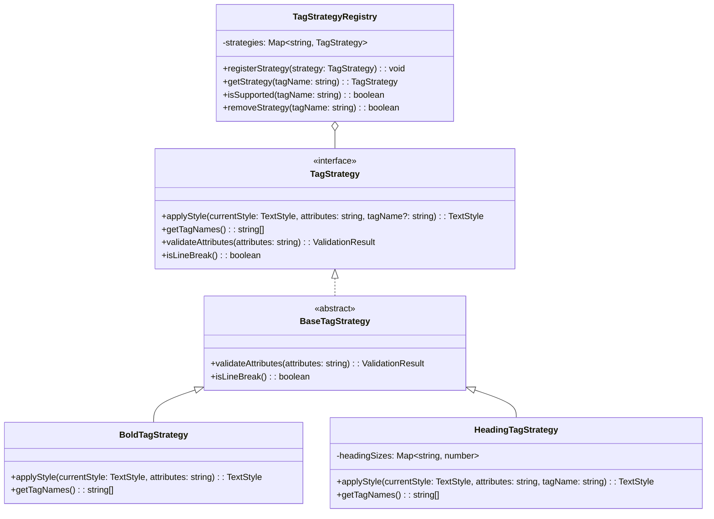

# Strategy System Documentation

## Overview

The strategy system is the core extensibility mechanism of the HTML-to-Vega-Lite converter. It implements the Strategy Pattern to provide flexible, modular HTML tag handling.

## Architecture

### Strategy Pattern Implementation



## Core Interfaces

### TagStrategy Interface

```typescript
interface TagStrategy {
  /**
   * Apply styling modifications based on the tag and its attributes
   * @param currentStyle - The current accumulated style
   * @param attributes - Raw attribute string from the HTML tag
   * @param tagName - The specific tag name (useful for multi-tag strategies)
   * @returns Modified style object
   */
  applyStyle(currentStyle: TextStyle, attributes: string, tagName?: string): TextStyle;
  
  /**
   * Get all HTML tag names this strategy handles
   * @returns Array of tag names (lowercase)
   */
  getTagNames(): string[];
  
  /**
   * Validate tag attributes (optional)
   * @param attributes - Raw attribute string
   * @returns Validation result with errors if any
   */
  validateAttributes?(attributes: string): { isValid: boolean; errors: string[] };
  
  /**
   * Indicate if this tag represents a line break (optional)
   * @returns True if tag should cause a line break
   */
  isLineBreak?(): boolean;
}
```

### BaseTagStrategy Abstract Class

Provides default implementations for optional methods:

```typescript
abstract class BaseTagStrategy implements TagStrategy {
  abstract applyStyle(currentStyle: TextStyle, attributes: string, tagName?: string): TextStyle;
  abstract getTagNames(): string[];
  
  public validateAttributes(attributes: string): { isValid: boolean; errors: string[] } {
    return { isValid: true, errors: [] };
  }
  
  public isLineBreak(): boolean {
    return false;
  }
}
```

## Built-in Strategies

### Text Formatting Strategies

#### BoldTagStrategy
- **Tags**: `<b>`, `<strong>`
- **Effect**: Sets `fontWeight: 'bold'`
- **Attributes**: None
- **Example**: `<b>Bold text</b>` → `{fontWeight: 'bold'}`

#### ItalicTagStrategy  
- **Tags**: `<i>`, `<em>`
- **Effect**: Sets `fontStyle: 'italic'`
- **Attributes**: None
- **Example**: `<i>Italic text</i>` → `{fontStyle: 'italic'}`

#### UnderlineTagStrategy
- **Tags**: `<u>`
- **Effect**: Sets `textDecoration: 'underline'`
- **Attributes**: None
- **Example**: `<u>Underlined</u>` → `{textDecoration: 'underline'}`

### CSS-Aware Strategies

#### SpanTagStrategy
- **Tags**: `<span>`
- **Effect**: Parses `style` attribute for CSS properties
- **Supported CSS**: `color`, `font-weight`, `font-style`, `text-decoration`, `font-size`
- **Example**: `<span style="color: red; font-weight: bold">Styled</span>`

**CSS Parsing Logic**:
```typescript
// Input: 'color: red; font-weight: bold; font-size: 16px'
// Output: { color: 'red', fontWeight: 'bold', fontSize: 16 }
```

### Structural Strategies

#### HeadingTagStrategy
- **Tags**: `<h1>`, `<h2>`, `<h3>`, `<h4>`, `<h5>`, `<h6>`
- **Effect**: Sets `fontWeight: 'bold'` and appropriate `fontSize`
- **Font Sizes**: H1=32px, H2=24px, H3=18.72px, H4=16px, H5=13.28px, H6=10.72px

**Implementation**:
```typescript
private headingSizes = new Map([
  ['h1', 32],
  ['h2', 24], 
  ['h3', 18.72],
  ['h4', 16],
  ['h5', 13.28],
  ['h6', 10.72]
]);
```

#### ParagraphTagStrategy
- **Tags**: `<p>`
- **Effect**: Currently preserves existing styles
- **Purpose**: Structural recognition for future paragraph-level formatting

#### LineBreakTagStrategy
- **Tags**: `<br>`
- **Effect**: No style changes
- **Special**: Returns `isLineBreak(): true` to trigger line breaks in layout

### Link Strategy

#### HyperlinkTagStrategy
- **Tags**: `<a>`
- **Effect**: Sets `color: '#0066cc'` (blue) and `textDecoration: 'underline'`
- **Validation**: Validates `href` attribute URL format
- **Error Cases**: Empty href, invalid URLs

**Validation Logic**:
```typescript
validateAttributes(attributes: string): ValidationResult {
  const href = this.extractHref(attributes);
  if (!href) return { isValid: false, errors: ['Missing href attribute'] };
  if (!this.isValidUrl(href)) return { isValid: false, errors: ['Invalid URL'] };
  return { isValid: true, errors: [] };
}
```

### Technical Content Strategies

#### CodeTagStrategy
- **Tags**: `<code>`, `<pre>`, `<kbd>`, `<samp>`
- **Effect**: Sets `color: '#d63384'` (magenta)
- **Purpose**: Distinguish code/technical content

#### HighlightTagStrategy
- **Tags**: `<mark>`
- **Effect**: Sets `color: '#212529'` (dark text for highlighted background)
- **Purpose**: Text highlighting

#### SmallTextTagStrategy
- **Tags**: `<small>`, `<sub>`, `<sup>`
- **Effect**: Sets `fontSize: 11.2` (0.8 * default)
- **Purpose**: Smaller text elements

### Advanced Strategies

#### StrikethroughTagStrategy
- **Tags**: `<s>`, `<strike>`, `<del>`
- **Effect**: Sets `textDecoration: 'line-through'` and `color: '#6c757d'` (muted)

#### ColorTagStrategy (Custom Example)
- **Tags**: Custom tags like `<red>`, `<blue>`, `<green>`
- **Effect**: Sets color based on tag name
- **Purpose**: Demonstration of custom strategy implementation

## Strategy Registry

### TagStrategyRegistry Class

Central management system for all strategies:

```typescript
class TagStrategyRegistry {
  private strategies = new Map<string, TagStrategy>();
  
  // Core operations
  registerStrategy(strategy: TagStrategy): void
  getStrategy(tagName: string): TagStrategy | undefined
  isSupported(tagName: string): boolean
  getSupportedTags(): string[]
  
  // Management operations  
  removeStrategy(tagName: string): boolean
  clearStrategies(): void
}
```

### Factory Functions

#### createDefaultTagStrategyRegistry()

Creates a fully-populated registry with all built-in strategies:

```typescript
export function createDefaultTagStrategyRegistry(): TagStrategyRegistry {
  const registry = new TagStrategyRegistry();
  
  // Core text formatting
  registry.registerStrategy(new BoldTagStrategy());
  registry.registerStrategy(new ItalicTagStrategy());
  registry.registerStrategy(new UnderlineTagStrategy());
  registry.registerStrategy(new SpanTagStrategy());
  
  // HTML structure
  registry.registerStrategy(new HeadingTagStrategy());
  registry.registerStrategy(new ParagraphTagStrategy());
  registry.registerStrategy(new HyperlinkTagStrategy());
  registry.registerStrategy(new LineBreakTagStrategy());
  
  // Technical content
  registry.registerStrategy(new CodeTagStrategy());
  registry.registerStrategy(new SmallTextTagStrategy());
  registry.registerStrategy(new HighlightTagStrategy());
  registry.registerStrategy(new StrikethroughTagStrategy());
  
  return registry;
}
```

#### createMinimalTagStrategyRegistry()

Creates a minimal registry with only basic formatting:

```typescript
export function createMinimalTagStrategyRegistry(): TagStrategyRegistry {
  const registry = new TagStrategyRegistry();
  
  registry.registerStrategy(new BoldTagStrategy());
  registry.registerStrategy(new ItalicTagStrategy());
  registry.registerStrategy(new UnderlineTagStrategy());
  registry.registerStrategy(new SpanTagStrategy());
  
  return registry;
}
```

## Usage Patterns

### Basic Usage

```typescript
import { HTMLToVegaLite } from 'html-vegalite';

// Uses default registry with all strategies
const converter = new HTMLToVegaLite();
const spec = converter.convert('<b>Bold</b> and <i>italic</i>');
```

### Custom Strategy Registration

```typescript
import { HTMLToVegaLite, CustomTagStrategy } from 'html-vegalite';

const converter = new HTMLToVegaLite();

// Add custom strategy
converter.registerTagStrategy(new CustomTagStrategy());

// Remove existing strategy
converter.unregisterTagStrategy('code');
```

### Minimal Setup

```typescript
import { 
  HTMLParser, 
  createMinimalTagStrategyRegistry,
  CustomTagStrategy 
} from 'html-vegalite';

// Start with minimal registry
const registry = createMinimalTagStrategyRegistry();
registry.registerStrategy(new CustomTagStrategy());

// Create parser with custom registry
const parser = new HTMLParser();
// Replace default registry
const customConverter = new HTMLToVegaLite();
customConverter.getStrategyRegistry().clearStrategies();
for (const tag of registry.getSupportedTags()) {
  const strategy = registry.getStrategy(tag);
  if (strategy) {
    customConverter.registerTagStrategy(strategy);
  }
}
```

## Creating Custom Strategies

### Simple Strategy Example

```typescript
import { BaseTagStrategy, TextStyle } from 'html-vegalite';

class BigTextStrategy extends BaseTagStrategy {
  applyStyle(currentStyle: TextStyle, attributes: string): TextStyle {
    return {
      ...currentStyle,
      fontSize: (currentStyle.fontSize || 14) * 1.5
    };
  }
  
  getTagNames(): string[] {
    return ['big'];
  }
}

// Usage
const converter = new HTMLToVegaLite();
converter.registerTagStrategy(new BigTextStrategy());
const spec = converter.convert('<big>Large text</big>');
```

### Advanced Strategy with Validation

```typescript
class ColoredTextStrategy extends BaseTagStrategy {
  private validColors = ['red', 'blue', 'green', 'yellow', 'purple'];
  
  applyStyle(currentStyle: TextStyle, attributes: string, tagName?: string): TextStyle {
    // Use tag name as color (e.g., <red>text</red>)
    const color = tagName || 'black';
    
    return {
      ...currentStyle,
      color: this.validColors.includes(color) ? color : currentStyle.color
    };
  }
  
  getTagNames(): string[] {
    return this.validColors;
  }
  
  validateAttributes(attributes: string): { isValid: boolean; errors: string[] } {
    // These tags don't use attributes, so any attributes are invalid
    if (attributes.trim()) {
      return {
        isValid: false,
        errors: ['Color tags do not accept attributes']
      };
    }
    return { isValid: true, errors: [] };
  }
}
```

### Multi-Mode Strategy

```typescript
class QuoteStrategy extends BaseTagStrategy {
  applyStyle(currentStyle: TextStyle, attributes: string, tagName?: string): TextStyle {
    const baseStyle = { ...currentStyle, fontStyle: 'italic' as const };
    
    switch (tagName) {
      case 'q':
        return { ...baseStyle, color: '#666666' };
      case 'blockquote':
        return { ...baseStyle, fontSize: (currentStyle.fontSize || 14) * 0.9 };
      case 'cite':
        return { ...baseStyle, color: '#888888' };
      default:
        return baseStyle;
    }
  }
  
  getTagNames(): string[] {
    return ['q', 'blockquote', 'cite'];
  }
}
```

## Style Application Process

### Style Stack Management

The parser maintains a style stack for nested tags:

```typescript
// HTML: <b><i>Bold italic</i></b>
// 
// Processing:
// 1. Start: { fontWeight: 'normal', fontStyle: 'normal', color: '#000000' }
// 2. <b>:   { fontWeight: 'bold',   fontStyle: 'normal', color: '#000000' }
// 3. <i>:   { fontWeight: 'bold',   fontStyle: 'italic', color: '#000000' }
// 4. </i>:  { fontWeight: 'bold',   fontStyle: 'normal', color: '#000000' }
// 5. </b>:  { fontWeight: 'normal', fontStyle: 'normal', color: '#000000' }
```

### Property Inheritance Rules

1. **Additive Properties**: Most properties replace previous values
2. **Cascade-Safe**: Nested styles inherit from parent context
3. **Restoration**: Closing tags restore previous style state

### Conflict Resolution

When multiple strategies could apply to the same property:

```typescript
// Example: <span style="color: red"><mark>highlighted red</mark></span>
// 
// Style application order:
// 1. SpanStrategy applies: { color: 'red' }
// 2. HighlightStrategy applies: { color: '#212529' } ← overwrites red
// 
// Final result: Highlight color wins
```

## Testing Strategies

### Unit Testing Pattern

```typescript
describe('CustomTagStrategy', () => {
  let strategy: CustomTagStrategy;
  
  beforeEach(() => {
    strategy = new CustomTagStrategy();
  });
  
  it('should return correct tag names', () => {
    expect(strategy.getTagNames()).toEqual(['custom']);
  });
  
  it('should apply custom styling', () => {
    const currentStyle: TextStyle = {
      fontWeight: 'normal',
      fontStyle: 'normal',
      color: '#000000'
    };
    
    const result = strategy.applyStyle(currentStyle, '');
    expect(result.color).toBe('#custom-color');
    expect(result.fontWeight).toBe('normal'); // Preserve other properties
  });
  
  it('should validate attributes correctly', () => {
    const validation = strategy.validateAttributes('invalid="value"');
    expect(validation.isValid).toBe(false);
    expect(validation.errors).toContain('Expected error message');
  });
});
```

### Integration Testing

```typescript
describe('Strategy Integration', () => {
  it('should handle nested strategies correctly', () => {
    const converter = new HTMLToVegaLite();
    const html = '<b><i>nested</i></b>';
    const spec = converter.convert(html);
    
    const layer = spec.layer[0];
    expect(layer.mark.fontWeight).toBe('bold');
    expect(layer.mark.fontStyle).toBe('italic');
  });
});
```

## Performance Considerations

### Strategy Lookup Optimization

- Registry uses `Map<string, TagStrategy>` for O(1) lookups
- Tag names are normalized to lowercase on registration
- No strategy compilation or caching needed

### Memory Management

- Strategies are stateless and can be reused
- Registry holds single instances of each strategy
- No per-parsing overhead for strategy creation

### Validation Performance

- Validation is optional and can be skipped for trusted input
- Expensive validations (like URL checking) only run when attributes are present

---

For more information, see:
- [Architecture Documentation](./ARCHITECTURE.md)
- [Extension Guide](./EXTENSIONS.md)
- [API Reference](./API.md)
